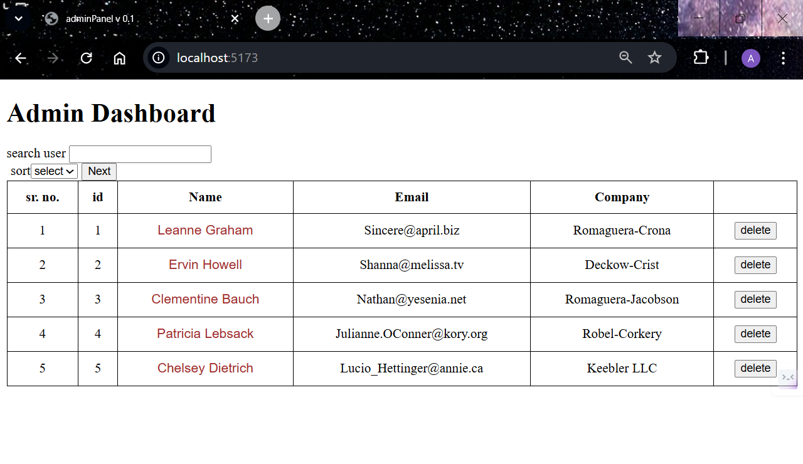
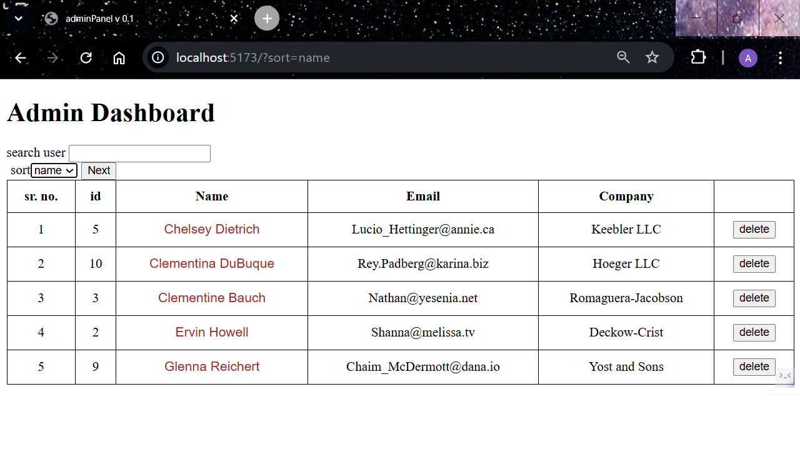
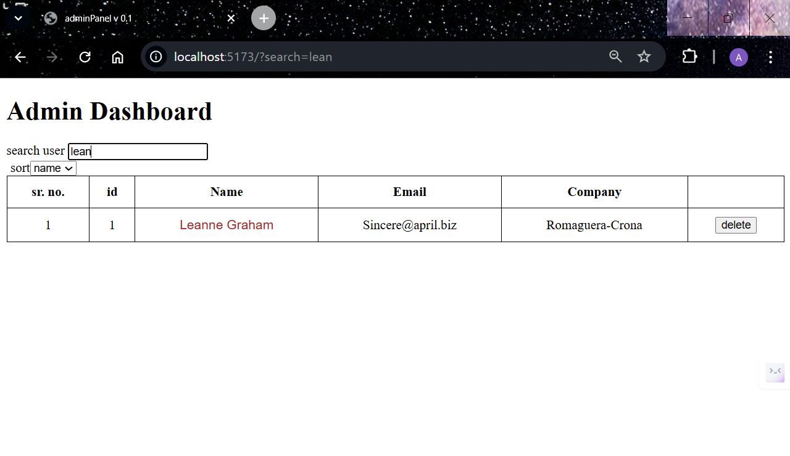
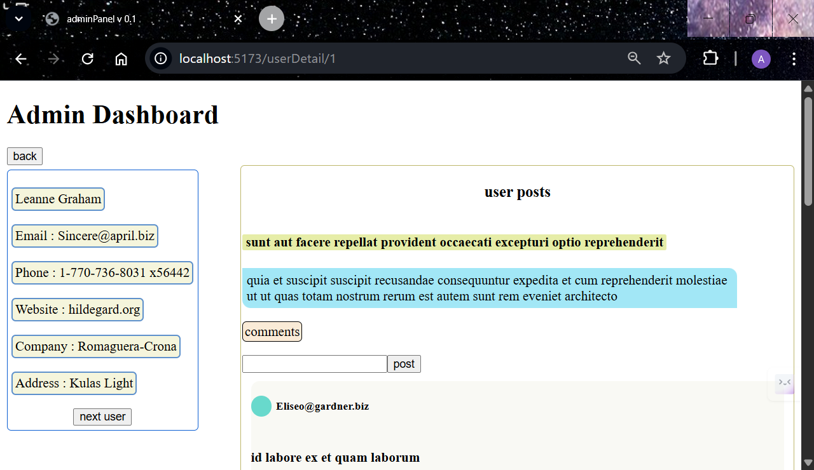
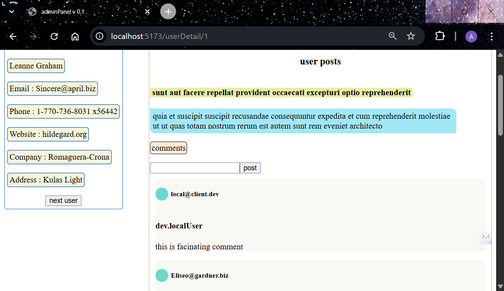

# React User Dashboard

A React-based dashboard application that allows users to browse user profiles, explore posts, view comments, and interact with dynamic UI states such as pagination, loading skeletons, retry handling, and optimistic updates.

This project demonstrates practical frontend architecture patterns used in real-world applications.

---
## Project Purpose

This project was built to practice real-world frontend architecture patterns such as routing, pagination, async state handling, and optimistic UI updates commonly used in production React applications.
---
## Live Demo,
Coming soon
---
## Features

• View user list  
• Navigate between users  
• Dynamic routing with React Router  
• Paginated user posts  
• Expand / collapse comment sections  
• Add comments with optimistic UI updates  
• Skeleton loading placeholders  
• Retry handling on failed API requests  
• Delete confirmation modal overlay  
• Previous / next user navigation logic

---

## Tech Stack

React  
React Router  
CSS  
Fetch API

---

## Concepts Demonstrated

Nested routing  
Dynamic route parameters  
Async request lifecycle handling  
Pagination logic  
Optimistic UI updates  
Skeleton loading UX  
Conditional rendering  
Component-level state management

---

## Run Locally
Clone repository
https://github.com/ashupublicgitrepo/react-dashboard.git
install dependencies,
run project

## Future Improvements

Backend integration
Authentication
Persistent comments storage

## Screenshots
### User List Page

### User List Sort

### User List Sort Search

### User Detail

### Post Section

